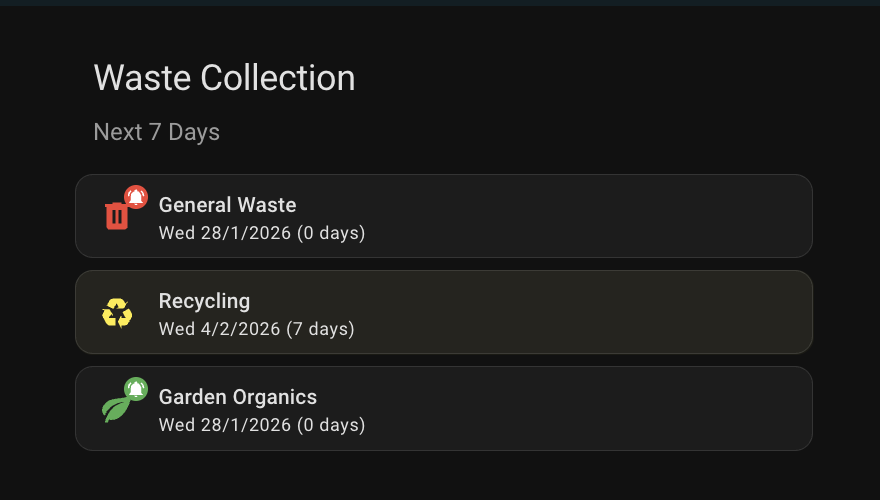

# Customization Guide

## 📸 Example



*Dynamic icon colors automatically change when collection is within 7 days.*


## Dynamic Icon Colors

Make your waste collection icons change color automatically as collection day approaches!

### Overview

Icons will:
- **Stay grey** when collection is more than 7 days away
- **Turn to bin color** when collection is 7 days or fewer away (including today!)
- Match actual Ryde Council bin colors: 🔴 Red (General), 🟡 Yellow (Recycling), 🟢 Green (Garden)

---

## Full Dashboard Example

**IMPORTANT**: You must use `mushroom-template-card` (not `mushroom-entity-card`) for dynamic colors to work.

### Complete Dashboard YAML

```yaml
title: Waste Collection
views:
  - title: Home
    path: home
    cards:
      - type: vertical-stack
        cards:
          - type: custom:mushroom-title-card
            title: Waste Collection
            subtitle: Next 7 Days
            
          - type: custom:mushroom-template-card
            primary: General Waste
            secondary: >-
              
                {{ states('sensor.ryde_waste_collection_general_waste') }}
                
                  ({{ state_attr('sensor.ryde_waste_collection_general_waste', 'days_until') }} days)
                
              
                No data available
              
            icon: mdi:trash-can
            icon_color: >-
              
                red
              
                grey
              
            badge_icon: >-
              
                mdi:bell-ring
              
            badge_color: red
            entity: sensor.ryde_waste_collection_general_waste
            tap_action:
              action: more-info
            
          - type: custom:mushroom-template-card
            primary: Recycling
            secondary: >-
              
                {{ states('sensor.ryde_waste_collection_recycling') }}
                
                  ({{ state_attr('sensor.ryde_waste_collection_recycling', 'days_until') }} days)
                
              
                No data available
              
            icon: mdi:recycle
            icon_color: >-
              
                yellow
              
                grey
              
            badge_icon: >-
              
                mdi:bell-ring
              
            badge_color: yellow
            entity: sensor.ryde_waste_collection_recycling
            tap_action:
              action: more-info
            
          - type: custom:mushroom-template-card
            primary: Garden Organics
            secondary: >-
              
                {{ states('sensor.ryde_waste_collection_garden_organics') }}
                
                  ({{ state_attr('sensor.ryde_waste_collection_garden_organics', 'days_until') }} days)
                
              
                No data available
              
            icon: mdi:leaf
            icon_color: >-
              
                green
              
                grey
              
            badge_icon: >-
              
                mdi:bell-ring
              
            badge_color: green
            entity: sensor.ryde_waste_collection_garden_organics
            tap_action:
              action: more-info
```

---

## Key Differences

### ❌ mushroom-entity-card (doesn't support dynamic colors)
```yaml
- type: custom:mushroom-entity-card
  entity: sensor.ryde_waste_collection_general_waste
  icon_color: red  # Only static colors work
```

### ✅ mushroom-template-card (supports dynamic colors)
```yaml
- type: custom:mushroom-template-card
  entity: sensor.ryde_waste_collection_general_waste
  primary: General Waste
  icon: mdi:trash-can
  icon_color: >-
    
      red
    
      grey
    
```

---

## Template Syntax

**Icon Color Template:**
```yaml
icon_color: >-
  
    red
  
    grey
  
```

**Secondary Text with Days:**
```yaml
secondary: >-
  
    {{ states('sensor.ryde_waste_collection_general_waste') }}
    
      ({{ state_attr('sensor.ryde_waste_collection_general_waste', 'days_until') }} days)
    
  
    No data available
  
```

**Alert Badge (today or tomorrow):**
```yaml
badge_icon: >-
  
    mdi:bell-ring
  
```

---

## Customizing the Threshold

Change the `<= 7` to adjust when colors appear:

**3 days notice:**
```yaml

```

**14 days notice:**
```yaml

```

---

## Benefits of mushroom-template-card

- ✅ **Full template support** for all properties
- ✅ **Custom secondary text** showing days until collection
- ✅ **Dynamic badges** for urgent collections
- ✅ **Flexible layouts** and styling
- ✅ **No additional dependencies** (just Mushroom)

---

## Color Reference

| Waste Type | When Colored | Icon Color | Otherwise |
|------------|--------------|------------|-----------|
| General Waste | 0-7 days | `red` | `grey` |
| Recycling | 0-7 days | `yellow` | `grey` |
| Garden Organics | 0-7 days | `green` | `grey` |

**Alert badges** (🔔) appear when collection is today (0) or tomorrow (1).

---

## Installing Mushroom Cards

1. Open **HACS** in Home Assistant
2. Go to **Frontend**
3. Click **Explore & Download Repositories**
4. Search for **Mushroom**
5. Click **Download**
6. Restart Home Assistant
7. Use the dashboard configuration above

---

## Why It Wasn't Working Before

The issue was using `mushroom-entity-card` which only supports **static** `icon_color` values (like `icon_color: red`).

The `mushroom-template-card` is specifically designed for **dynamic templates** and supports:
- Template expressions in `icon_color`
- Template expressions in `primary`, `secondary`
- Template expressions in `badge_icon`, `badge_color`
- Full Jinja2 template syntax

Always use `mushroom-template-card` when you need dynamic colors or text!
