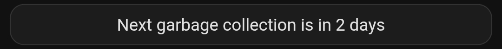
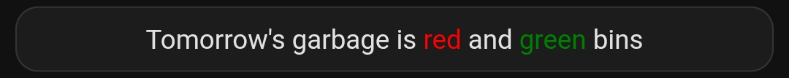

# Customisation Guide
Home assistant dashboards vary widely, so several options provided and summarised below.

Mushroom Card Dashboard
- ✅ **Full template support** for all properties
- ✅ **Custom secondary text** showing days until collection
- ✅ **Dynamic badges** for urgent collections
- ✅ **Flexible layouts** and styling
- ✅ **No additional dependencies** (just Mushroom)

Dynamic Single Card

- ✅ **Full template support** for all properties
- ✅ **Dynamic custom text** showing next bins or days until collection
- ✅ **Flexible layouts** and styling
- ❌ **Two dependencies** (button-card and state-switch)

## 📸 Mushroom Card Dashboard


*Dynamic icon colors automatically change when collection is within 7 days.*

Icons will:
- **Stay grey** when collection is more than 7 days away
- **Turn to bin color** when collection is 7 days or fewer away (including today!)
- Match actual Ryde Council bin colors: 🔴 Red (General), 🟡 Yellow (Recycling), 🟢 Green (Garden)


### Installing Mushroom Cards

1. Open **HACS** in Home Assistant
2. Go to **Frontend**
3. Click **Explore & Download Repositories**
4. Search for **Mushroom**
5. Click **Download**
6. Restart Home Assistant
7. Use the dashboard configuration below

Once installed, you can use either of the below cards within your dashboard.

#### Using mushroom-entity-card

- ❌ **Doesn't support dynamic colours**
- ✅ **No additional dependencies** (just Mushroom)

```yaml
- type: custom:mushroom-entity-card
  entity: sensor.ryde_waste_collection_general_waste
  icon_color: red  # Only static colors work
```

#### Using mushroom-template-card

- ✅ **Full template support** for all properties
- ✅ **Custom secondary text** showing days until collection
- ✅ **Dynamic badges** for urgent collections
- ✅ **Flexible layouts** and styling
- ✅ **No additional dependencies** (just Mushroom)

```yaml
- type: custom:mushroom-template-card
  entity: sensor.ryde_waste_collection_general_waste
  primary: General Waste
  icon: mdi:trash-can
  icon_color: >-
    
      red
    
      grey
    
```

### Complete Dashboard YAML

Copy/Paste the below code into a new card.

---

```yaml
title: Waste Collection
views:
  - title: Home
    path: home
    cards:
      - type: vertical-stack
        cards:
          - type: custom:mushroom-title-card
            title: Waste Collection
            subtitle: Next 7 Days
            
          - type: custom:mushroom-template-card
            primary: General Waste
            secondary: >-
              
                {{ states('sensor.ryde_waste_collection_general_waste') }}
                
                  ({{ state_attr('sensor.ryde_waste_collection_general_waste', 'days_until') }} days)
                
              
                No data available
              
            icon: mdi:trash-can
            icon_color: >-
              
                red
              
                grey
              
            badge_icon: >-
              
                mdi:bell-ring
              
            badge_color: red
            entity: sensor.ryde_waste_collection_general_waste
            tap_action:
              action: more-info
            
          - type: custom:mushroom-template-card
            primary: Recycling
            secondary: >-
              
                {{ states('sensor.ryde_waste_collection_recycling') }}
                
                  ({{ state_attr('sensor.ryde_waste_collection_recycling', 'days_until') }} days)
                
              
                No data available
              
            icon: mdi:recycle
            icon_color: >-
              
                yellow
              
                grey
              
            badge_icon: >-
              
                mdi:bell-ring
              
            badge_color: yellow
            entity: sensor.ryde_waste_collection_recycling
            tap_action:
              action: more-info
            
          - type: custom:mushroom-template-card
            primary: Garden Organics
            secondary: >-
              
                {{ states('sensor.ryde_waste_collection_garden_organics') }}
                
                  ({{ state_attr('sensor.ryde_waste_collection_garden_organics', 'days_until') }} days)
                
              
                No data available
              
            icon: mdi:leaf
            icon_color: >-
              
                green
              
                grey
              
            badge_icon: >-
              
                mdi:bell-ring
              
            badge_color: green
            entity: sensor.ryde_waste_collection_garden_organics
            tap_action:
              action: more-info
```

---

### Mushroom Card Template Syntax

**Icon Color Template:**
```yaml
icon_color: >-
  
    red
  
    grey
  
```

**Secondary Text with Days:**
```yaml
secondary: >-
  
    {{ states('sensor.ryde_waste_collection_general_waste') }}
    
      ({{ state_attr('sensor.ryde_waste_collection_general_waste', 'days_until') }} days)
    
  
    No data available
  
```

**Alert Badge (today or tomorrow):**
```yaml
badge_icon: >-
  
    mdi:bell-ring
  
```

---

### Customizing the Threshold

Change the `<= 7` to adjust when colors appear:

**3 days notice:**
```yaml

```

**14 days notice:**
```yaml

```

---

### Color Reference

| Waste Type | When Colored | Icon Color | Otherwise |
|------------|--------------|------------|-----------|
| General Waste | 0-7 days | `red` | `grey` |
| Recycling | 0-7 days | `yellow` | `grey` |
| Garden Organics | 0-7 days | `green` | `grey` |

**Alert badges** (🔔) appear when collection is today (0) or tomorrow (1).

---

## Dynamic Single Card

This example uses a single card to dynamically present a summary for embedding within an existing dashboard.





### Installing Dependencies

1. Open **HACS** in Home Assistant
2. Go to **Frontend**
3. Click **Explore & Download Repositories**
4. Search for **button-card** (by RomRider)
5. Click **Download**
6. Search for **state-switch** (by Tomas Lovén)
7. Restart Home Assistant
8. Use the card steps below

#### Using button-card

- ✅ **Custom secondary text** showing days until collection
- ✅ **No additional dependencies** (just Button-Card)
- ✅ **Dynamic badges** for urgent collections
- ✅ **Flexible layouts** and styling
- ✅ **Very configurable** to show various attributes/layouts (see [documentation](https://custom-cards.github.io/button-card/stable/))
- ❌ **Dynamic colours are complex** (easier to use state-switch)
- ❌ **Template support** requires javascript

```yaml
type: custom:bytton-card
entity: sensor.ryde_waste_collection_general_waste
icon: red #(supports templates for colour)
show_state: true
```

#### Using state-switch

- ✅ **Supplements cards** in lots of ways (see [documentation](https://github.com/thomasloven/lovelace-state-switch))
- ✅ **Full template support** for all properties
- ❌ **Additional dependencies** (state-switch plus button-card)

```yaml
type: custom:state-switch
entity: deviceID #this can be an entity with multiple states, or a template
states:
  state1:
    type: card1
  state2:
    type: card2
  state9:
    type: card9
```

### Dynamic Card YAML

Copy/Paste the below code into a new card on an existing dashboard.

---

```yaml
type: custom:state-switch
entity: template
template: >-
  
    tmrw
   
    othr
  
states:
  tmrw:
    type: custom:button-card
    entity: sensor.ryde_waste_collection_general_waste
    show_icon: false
    show_name: false
    styles:
      grid:
        - height: 6px
        - font-size: 14px
    state_display: |-
      [[[
        // Helpers to safely read state and attribute
        const getState = (id) => hass?.states?.[id]?.state ?? states?.[id]?.state;

        const gwId  = 'sensor.ryde_waste_collection_general_waste';
        const recId = 'sensor.ryde_waste_collection_recycling';
        const goId  = 'sensor.ryde_waste_collection_garden_organics';

        const gw  = getState(gwId);
        const rec = getState(recId);
        const go  = getState(goId);

        if (gw === rec && rec === go) {
          return `Tomorrow's garbage is <b>all</b> the bins`;
        } else if (gw === rec) {
          return `Tomorrow's garbage is <span style="color: red;">red</span> and <span style="color: yellow;">yellow</span> bins`;
        } else if (gw === go) {
          return `Tomorrow's garbage is <span style="color: red;">red</span> and <span style="color: green;">green</span> bins`;
        } else {
          return "There's been an error";
        }
      ]]]
    show_state: true
  othr:
    type: custom:button-card
    entity: sensor.ryde_waste_collection_general_waste
    show_icon: false
    show_name: false
    styles:
      grid:
        - height: 6px
        - font-size: 14px
    state_display: |-
      [[[
        // Helpers to safely read state and attribute
        const getState = (id) => hass?.states?.[id]?.state ?? states?.[id]?.state;
        const getAttr  = (id, attr) => hass?.states?.[id]?.attributes?.[attr];

        const gwId  = 'sensor.ryde_waste_collection_general_waste';

        const gw  = getState(gwId);

        // Fetch the attribute: state_attr("sensor.ryde_waste_collection_general_waste", "days_until")
        const daysUntilGW = getAttr(gwId, 'days_until');

        if (gw === gw) {
          return `Next garbage collection is in ${daysUntilGW} days`;
        } else {
          return "There's been an error";
        }
      ]]]
    show_state: true

```

---